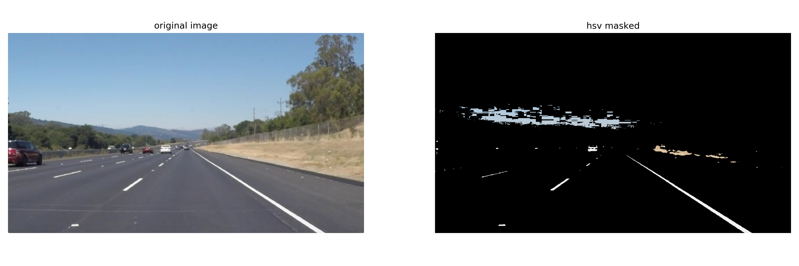
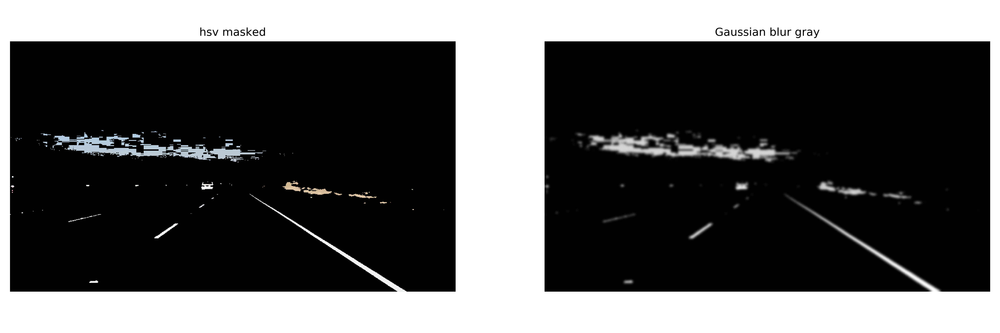
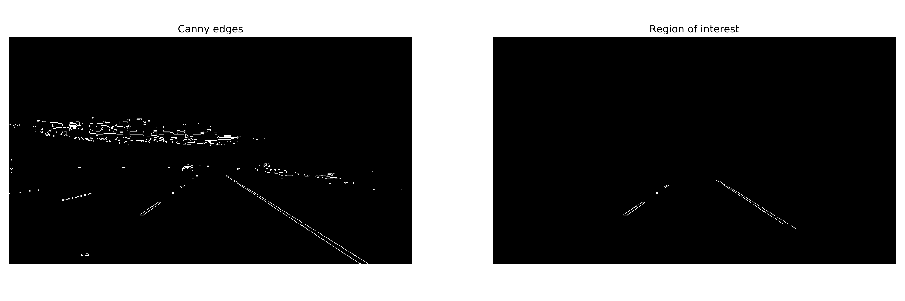

# **Finding Lane Lines on the Road** 

Overview
---

When we drive, we use our eyes to decide where to go.  The lines on the road that show us where the lanes are act as our constant reference for where to steer the vehicle.  Naturally, one of the first things we would like to do in developing a self-driving car is to automatically detect lane lines using an algorithm.

In this project you will detect lane lines in images using Python and OpenCV.  OpenCV means "Open-Source Computer Vision", which is a package that has many useful tools for analyzing images.  

## Dependencies

All dependecies are included in CarND conda enviroment. Please check and install [CarND Term1 Starter Kit](https://github.com/udacity/CarND-Term1-Starter-Kit) if you have problem to run the code. 

## Reflection

### 1. Project Pipeline

This part is the pipeline for detecting lanelines of one single image token from the car camera.
The general process is:

* 1. As our goal is to detect the lanelines whose colors are either white or yellow, we convert the RGB image to HSL color space to isolate the white and yellow part of the image. The introduction of HSL color space can be found on [Wikipedia](https://en.wikipedia.org/wiki/HSL_and_HSV). Thus, an image with only white and yellow part is obtained.

* 2. The masked image is converted to gray scale for further processing. 

* 3. Gaussian kernel is operated over image to blur the gray-scale image. 

* 4. To detect the edges, the Canny operator is conducted. 

* 5. Based on the detected edges, we're only interested in the specific region. Thus, it is necessary to crop the region of interest in order to eliminate the noise for fitting the lanelines.

* 6. Then, Hough transformation is used to get the line segments. Details of Hough transformation can be found at [Wikipedia](https://en.wikipedia.org/wiki/Hough_transform).

* 7. In this stage, we only have several line segments which are not a solid full lane. So, we extrapolate them to get the full extent of the lane. The process of function, draw_lines is shown as follows:
    
    *1. Enumerate all line segments, the slope of each line is computed accordingly. If x2 == x1, the line is vertical and should be discarded. Also, there are some horizontal lines which can disturb the final estimation, we disard such cases via condition abs(slope) > 0.1. 
    
    *2. Save all negative and positive slope lines corrdinates, seperately. 
    
    *3. Fit two lines with np.polyfit (order = 1) and corresponding coordinates. (w, intercept) = np.polyfit(data)
    
    *4. Find the minimal and maximal y coordinates.
    
    *5. Then, the x coordinates can be computed via (y - intercept) / w for two lines (negative and positive slopes).
    
    *6. Draw the lanelines according to the top and bottom coordinates of two lines. 
    

### 2. Potential shortcomings

* 1. The final line finding depends on the cropped region, which should be adpative to different kind of videos. When the scenes change, the vertices for cropping may not working. 

* 2. The pipleline fails for some frames in challenge video. In such cases, straight line may not be a good choice and it is not robust engouh. 

* 3. Also, the pipeline does not consider the temporal relationship, which is also the reason why it is so sensitive regarding direction changes in challenge video.

### 3. Possible improvements.

* 1. Use [generalized hough transform](https://en.wikipedia.org/wiki/Generalised_Hough_transform) insead of using hough line transformation for making the line detection more robust. 

* 2. Use [RANSAC](https://en.wikipedia.org/wiki/Random_sample_consensus) for fitting the line. 

* 3. Add temporal constraints to make the detection temporally smooth.

* 4. Use Machine Learning and Deep Learning methods to achieve line detection. 

